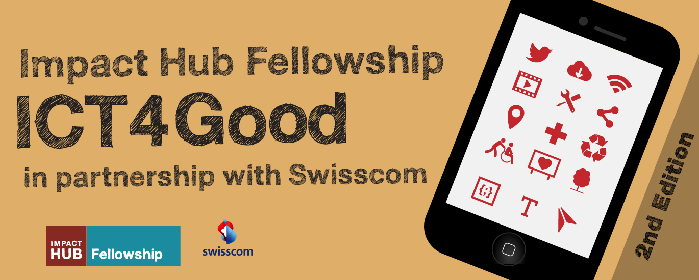
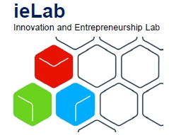
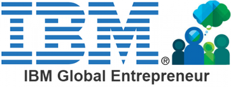
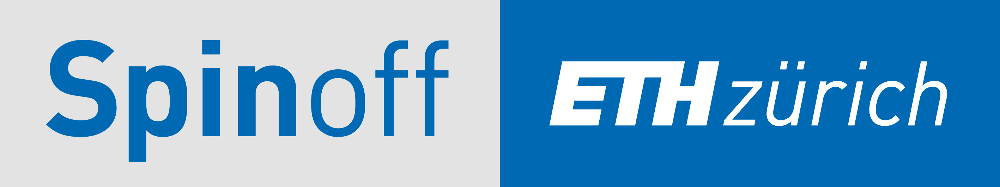

---

title: About us

---

# About us

4Quant is a Spin-off of [ETH Zurich](https://www.ethz.ch/de.html) and the [Paul Scherrer Institut](https://www.psi.ch/) based on the [PhD Thesis]() of [Kevin Mader](https://ch.linkedin.com/in/kevinmader) done in the [X-Ray Microscopy Laboratory](https://www.psi.ch/lsb-tomography/x-ray-tomography-group) of Marco Stampanoni.

We are funded by the [Pioneer Fellowship](https://www.ethz.ch/en/research/research-promotion/eth-internal-programmes/pioneer-fellowships.html) of the ETH Zurich and a member of the [ETH Innovation and Entrepreneurship Lab](https://www.ethz.ch/en/industry-and-society/innovation-and-setting-up-companies/ielab.html). We are built on a strong foundation of partnerships ranging from the [IBM Global Entrepreneur Program](https://www-01.ibm.com/software/info/ecod/cloudoffer/startup.html) and [Databricks](https://databricks.com/) for Cloud Support to [SLS Techno Trans AG](https://www.psi.ch/sls-techno-trans-ag/) for access to the latest generation of imaging techniqes.

We are committed to Open Source and have many of our projects available on [Github](https://github.com/4Quant) and we push many of our latest developments back to the core project so the entire community can benefit from our developments.

## Team

<dl class="team">
    <dt>Joachim Hagger</dt>
    <dd>
        <ul>
            <li></li>
            <li>CEO</li>
            <li>Lorem ipsum dolor sit amet, consectetur adipisicing elit. Veniam, deserunt.</li>
        </ul>
    </dd>
    <dt>Dr. Kevin Mader</dt>
    <dd>
        <ul>
        <li></li>
        <li>CTO</li>
        <li>Lecturer at ETH Zurich; Postdoc in the X-Ray Microscopy Group at ETH Zurich and Swiss Light Source at Paul Scherrer Institute</li>
    </ul>
    </dd>

    <dt>Flavio Trolese</dt>
    <dd>
        <ul>
        <li></li>
        <li>CFO</li>
        <li>Lorem ipsum dolor sit amet, consectetur adipisicing elit. Minus quod itaque, quos dicta sed temporibus nihil, veniam non quas in nam! Fugit natus maxime cum necessitatibus doloribus nostrum. Est, ut.</li></ul>
    </dd>

</dl>

## Advisors

<dl class="team">
    <dt>Prof. Dr. Marco Stampanoni</dt>
    <dd>
        <ul>
            <li>Lorem ipsum dolor.</li>
            <li>Lorem ipsum dolor sit amet, consectetur adipisicing elit.</li>
        </ul>
    </dd>
    <dt>Prof. Dr. Keith Cheng</dt>
    <dd>
        <ul>
        <li>Chief of Experimental Pathology at Penn State Medical Center</li>
        <li>Lorem ipsum dolor sit amet, consectetur adipisicing elit.</li>
    </ul>
    </dd>

    <dt>Dr. Marcos Garcia Pedreza</dt>
    <dd>
        <ul>
        <li>Lorem ipsum dolor.</li>
        <li>Lorem ipsum dolor sit amet, consectetur adipisicing elit.</li></ul>
    </dd>

    <dt>Dr. Bram Stieltjes</dt>
    <dd>
        <ul>
        <li>Research coordinator on Radiation Therapy at University of Basel</li>
        <li>Lorem ipsum dolor sit amet, consectetur adipisicing elit.</li>
    </ul>
    </dd>
</dl>

Customers
: 

    
    
    
    
    
    
    

Partner
: 

    
    
    
    
    

Affiliations
: 

      
      
      
      
      

## Get in touch

You can get in touch via [email](mailto:i%6Efo@4%71u%61nt.com), [Twitter](https://twitter.com/4quant), [Linkedin](https://www.linkedin.com/company/4quant) or [Facebook](https://www.facebook.com/4quant/).  
 
4Quant Ltd. 
Binzmühlestrasse 56 
CH-8050 Zurich 
 
[&#105;n&#102;&#111;&#64;4&#113;uan&#116;&#46;&#99;&#111;m](mailto:i%6Efo@4%71u%61nt.com)  
CHE-168.792.194  
