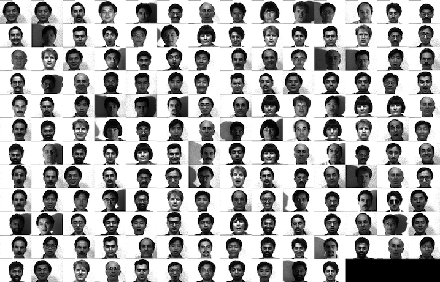
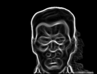
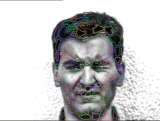
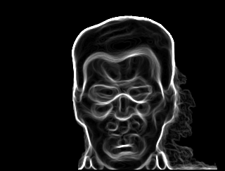
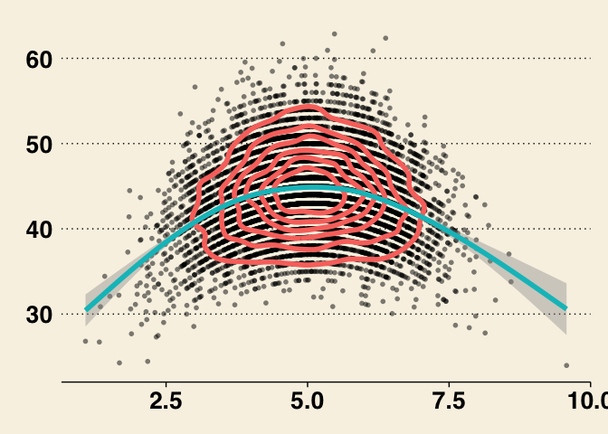
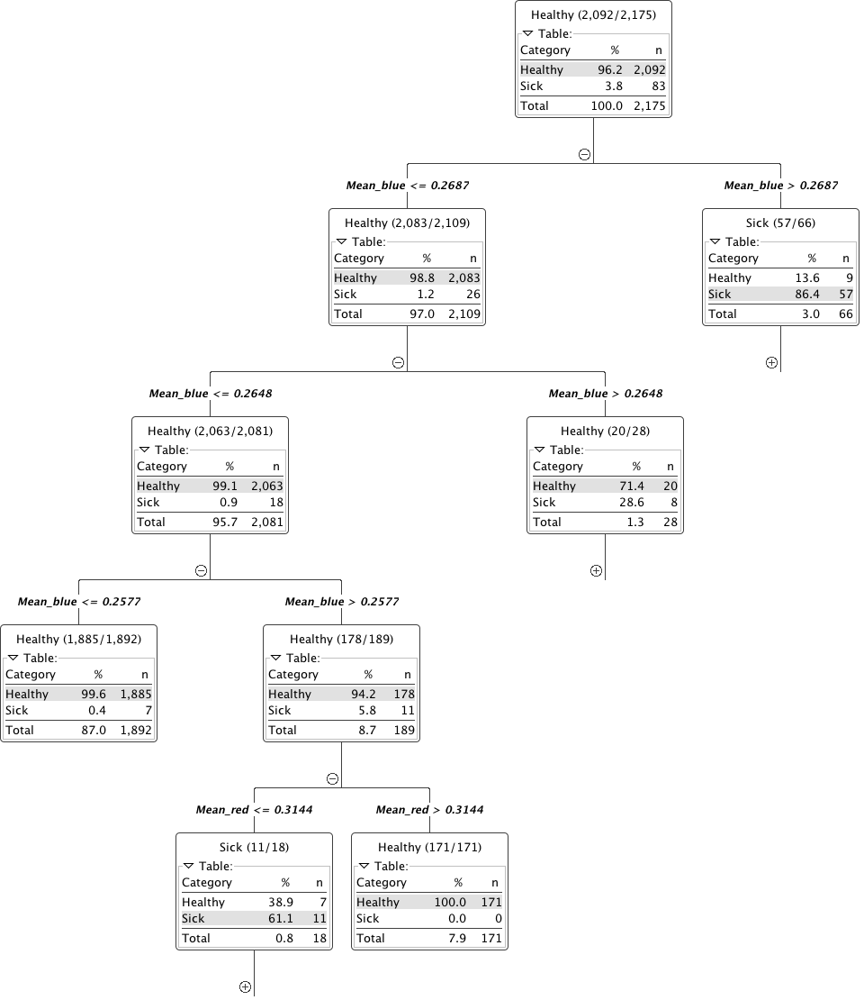

# Online Dating Analytics

## Sifting through the noise in Online Dating

> Today, if you own a smartphone, you’re carrying a 24-7 singles bar in your pocket. - Aziz Ansari, Modern Romance: An Investigation

SUMMARY_STARTModern dating platforms have drastically increased the number of possibilities for modern singles. With this great selection comes, howeverSUMMARY_END, the [paradox of choice](https://en.wikipedia.org/wiki/The_Paradox_of_Choice) which causes a plethora to quickly transform from an opportunity to a burden. While many sites provide specialized matching algorithms based on your shared like of cats or affinity for Pearl Jam songs, but defining physical characteristics are completely left out. Occasionally self-descriptions are available but are not usually reliable. Endless swiping through images and profiles to find the needles in the haystack is an exhausting process.

## Image Query and Analysis Engine

Within each face are millions of possible metrics ranging from nostril size to eye spacing which collectively fit together to define your own version of beauty. Quantitative image analytics can be used to extract these metrics from millions of images in seconds and help filter out the riff-raff and keep only the desired results.

SELECT Winking=TRUE AND HAIR_COLOR = "black"

###  Real-time

More importantly than a single query, is the ability to perform queries on complex datasets in real-time and have the processing distributed over a number of machines.

  
  
  
  

### How?

The first question is how the data can be processed. The basic work is done by a simple workflow on top of our Spark Image Layer. This abstracts away the complexities of cloud computing and distributed analysis. You focus only on the core task of image processing.

  

The true value of such a scalable system is not in the single analysis, but in the ability to analyze hundreds, thousands, and even millions of samples at the same time.

With cloud-integration and *Big Data*-based frameworks, even handling an entire city network with 100s of drones and cameras running continuously is an easy task without worrying about networks, topology, or fault-tolerance.

### What?

The images come from one or more dating sites or apps in the form of a real-time stream.

The first step is to identify the background and the region for the face inside of the image.

The second is to enhance selectively the features in the face itself so they can be more directly quantified and analyzed.

The edges can then be used to generate features on the original face to use as the basis for extracting quantitative metrics.

### Possibilities

With the ability to segment and analyse faces and features in huge collections of images without processing beforehand, the possibilities are endless. Of particlar interest is the ability to investigate specific metrics as they related to relationship success, for example eye separation and number of *likes*.

~~~ sql
  SELECT CORR2(left_eye.x-right_eye.x,likes) FROM (  
    SELECT face.left_eye.x,face.right_eye.x,likes FROM (  
      SELECT SEGMENT_FACE(profile_image) AS face,likes FROM USER  
    )  
  )
~~~

### Machine Learning

The quantitatively meaningful data can then be used to train machine learning algorithms (decision trees to SVM) in order to learn from previous successes or failures.

Here we show a simple decision tree trained to identify good and bad on the basis of color, position, texture and shape.

Furthermore the ability to parallelize and scale means thousands to millions of images and profiles can be analyzed at the same time to learn even more about your preferences.

## Learn More

4Quant is active in a number of different areas from medicine to remote sensing. Our image processing framework (Spark Image Layer) and our query engine (Image Query and Analysis Engine) are widely adaptable to a number of different specific applications.

### Use Cases

Check out our other use-cases to see how 4Quant can help you

#### Medicine

* [Planning surgery and radiotherapy with real time segmentations](http://4quant.com/Realtime-MRI-Segmentation)
* [Segmenting organs from archived chest CT images](http://4quant.com/Organ-Segmentation/)
* [Finding lesions in Capsule Based Endoscopy](http://4quant.com/Capsule-Endoscopy)

#### Geographic Information Systems

* [Calculating Flood Risk for Insurance Companies](http://4quant.com/Flood-Risk)
* [Counting Cars in Satellite Images](http://4quant.com/countingcarsdemo)
* [Finding buildings and forests in Satellite Images](http://4quant.com/geospatialdemo/)

#### Surveillance

* [Count people from drone footage](http://4quant.com/Drone-People-Counting)
* [Finding criminals with traffic cameras](http://4quant.com/Pursuing-Criminals/)

#### Real-time QA

* [Check train tracks in real time](http://4quant.com/Railway-Check)

#### Fun

* [Untangling the flood of Online Dating](http://4quant.com/Online-Dating)
* [Quantitative Image Search Machine](http://kmader.shinyapps.io/SearchMachineDemo)

### Technical Presentations

To find out more about the technical aspects of our solution, check out our presentation at:

* [Spark Summit](http://4quant.com/spark-east-2015) or watch the [video](https://www.youtube.com/watch?v=ohR_y7HZaHA&index=10&list=PL-x35fyliRwiy50Ud2ltPx8_yA4H34ppJ).
* [Synchrotron Radiation Instruementation 2015](http://4quant.com/SRI2015)
* [ICTMS 2015](http://4quant.com/ICTMS2015)
* [LifeScienceForumBasel 2015](http://4quant.com/LSFB2015)
