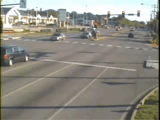
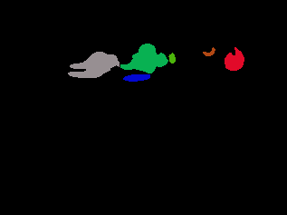
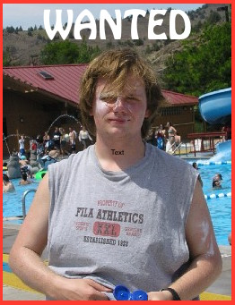
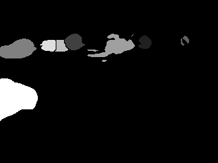
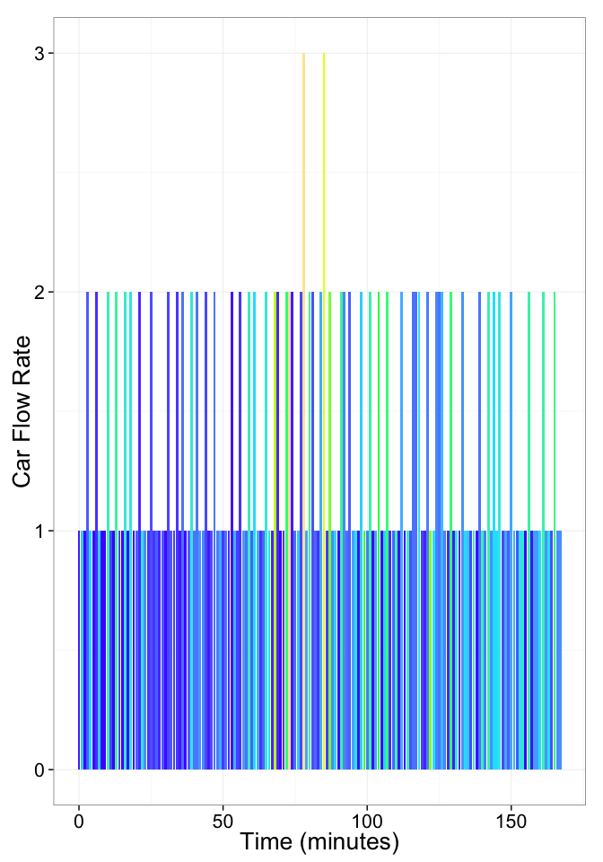
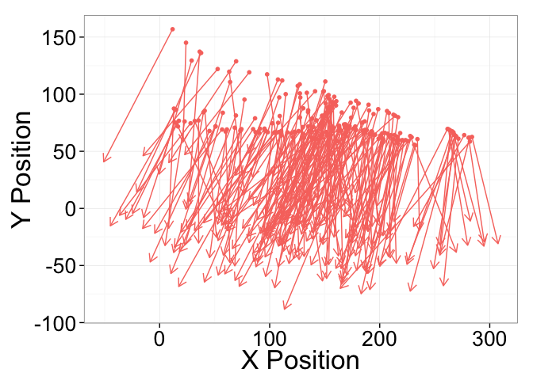
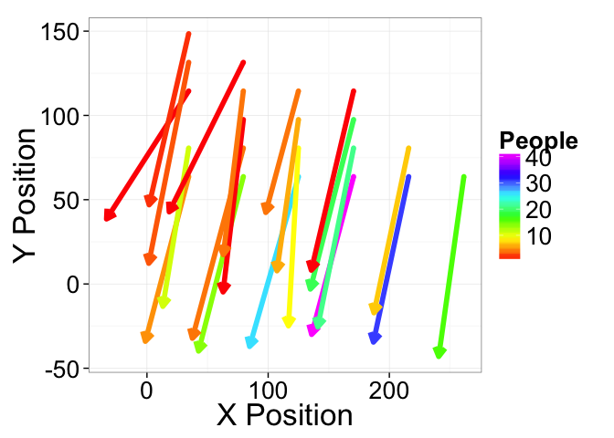

# Vehicle Tracking

## Pursuing Criminals

SUMMARY_STARTIn a wide range of crimes from grand theft auto to child abduction, it is important to be able to find SUMMARY_ENDthe exact location and reconstruct the past movements of a single vehicle. Some technologies from licence plate recognition at parking garages to on the ground officer deployment are used to alleviate this issue, but finding a single car still proves very difficult, time-consuming, and expensive.

## Real-time Traffic Camera Analytics

Traffic cameras are in wide-spread use for monitoring the movement of cars and identifying problems. The information from these cameras is rich and the combination of an entire network of images can reconstruct the movements of a single vehicle.


The image data on their own are however difficult to process and particularly examining an entire network has typically required hundreds of expensive employees to hand screen the images (approximately 2 per employee). Electronic solutions while existant are typically inflexible, and poorly scalable to the types of problems needed for real-time ad-hoc analysis.

### Real-time image processing


Using our 4Quant SQL, it is now possible to process these streams in a flexible scalable manner to query the live stream of images as if they were all in a database.

```
SELECT * FROM TrafficCameras WHERE DETECT_CAR(image)
```

<div class="row">
  <div class="col-sm-3 col-xs-12">
    
  </div>
  <div class="col-sm-3 col-xs-12">
    
  </div>
  <div class="col-sm-3 col-xs-12">
    
  </div>
  <div class="col-sm-3 col-xs-12">
    
  </div>
</div>

More importantly many streams can be integrated together and queried as one coherent entity. For example if a white car has been reported missing, thousands the cameras can be screened for bars by color

```SQL
SELECT position,color FROM TrafficCameras WHERE <br>
  DETECT_CAR(image) GROUP BY DETECT_CAR(image).COLOR
```

<div class="embed-responsive embed-responsive-16by9">
  <iframe src="http://4quant.com/Pursuing-Criminals/widget_carmap.html" class="embed-responsive-item"></iframe>
</div>

If we know the care was a white Subaru, we can further limit the results by taking only the white cars whose make is Subaru.

```
  SELECT position FROM TrafficCameras WHERE
    DETECT_CAR(image).MAKE="Subaru" AND
    DETECT_CAR(image).COLOR="white"
```

<div class="embed-responsive embed-responsive-16by9">
  <iframe src="http://4quant.com/Pursuing-Criminals/widget_whitemap.html" class="embed-responsive-item"></iframe>
</div>

Now we can start to integrate the other information about the time (the last 10 minutes) and an idea about where the perpetrator might be (100km of Zurich).

```
  SELECT image,position FROM TrafficCameras WHERE
    TIME BETWEEN 10:40 AND 10:50 AND
    DISTANCE(position,"Zurich")<100
    DETECT_CAR(image).MAKE="Subaru" AND
    DETECT_CAR(image).COLOR="white"
```

<div class="embed-responsive embed-responsive-16by9">
  <iframe src="http://4quant.com/Pursuing-Criminals/widget_foundmap.html" class="embed-responsive-item"></iframe>
</div>

The final step is to identify the license plate number and compare it to the [ASTRA database](http://www.astra.admin.ch/) to identify exactly who this scoundrel is and put them to justice.

```
  SELECT Astra.Owner.Picture FROM TrafficCameras WHERE
    TIME BETWEEN 10:40 AND 10:50 AND
    DISTANCE(position,"Zurich")<100
    DETECT_CAR(image).MAKE="Subaru" AND
    DETECT_CAR(image).COLOR="white"
    INNER JOIN astraCarTable as Astra ON
    DETECT_CAR(image).LICENCE_PLATE = Astra.ID
```

  

### How?

The first question is how the data can be processed. The basic work is done by a simple workflow on top of our Spark Image Layer. This abstracts away the complexities of cloud computing and distributed analysis. You focus only on the core task of image processing.

<div class="row">
  <div class="col-xs-12">
    
  </div>
</div>

Beyond a single camera, our system scales linearly to multiple cameras and can distribute this computation across many computers to keep the computation real-time.

<div class="row">
  <div class="col-xs-12">
    
  </div>
</div>

With cloud-integration and *Big Data*-based frameworks, even handling an entire city network with 100s of drones and cameras running continuously is an easy task without worrying about networks, topology, or fault-tolerance. Below is an example for 30 traffic cameras where the tasks are seamlessly, evenly divided among 50 different computers.

<div class="row">
  <div class="col-xs-12">
    
  </div>
</div>

### What?

The images which are collected by the traffic cameras at rate of 30 frames per second contain substantial dynamic information on not only cars, but buildings, landscapes, and people. The first basic task is the segmentation of the people which can provide information on their number, movement, and behavior

<div class="row">
  <div class="col-xs-12">
    
  </div>
</div>

The segmented image above can be transformed into quantitative metrics at each time point. These metrics can then be processed to extract relevant quality assessment information for the tracks.

<div class="row">
  <div class="col-xs-12">
    
  </div>
</div>

The data can then be broken down into small scenes where the number and flow of cars in each grouping can be evaluated.




The data can also be smoothed to show more clearly trends and car counts on a single image.



## Technical Aspects

### Streaming the Data

Once the cluster has been comissioned and you have the *StreamingSparkContext* called `ssc` (automatically provided in [Databricks Cloud](https://databricks.com/product/databricks-cloud) or [Zeppelin](http://zeppelin.incubator.apache.org/)), the data can be loaded using the Spark Image Layer. Since we are using real-time analysis, we acquire the images from a streaming source

```
  val trafficCam1 = TrafficCameraReceiver("https://drone-8092")
  val trafficCam2 = TrafficCameraReceiver("https://drone-8093")
  val metaImageStream = ssc.receiverStream(trafficCam1 ++ trafficCam2)
```

Although we execute the command on one machine, the analysis will be distributed over the entire set of cluster resources available to `ssc`. To further process the images, we can take advantage of the rich set of functionality built into Spark Image Layer

```
  def identifyCar(time: Double, pos: GeoPos, inImage: Img[Byte]) = {
    // Run the image processing steps on all images
    val carOutline = inImage.
      window(3s).
      run("Median...","radius=3"). // filter out the noise
      run("Rolling Background Subtraction..."). // remove static objects
      run("Threshold","OTSU") // threshold bright structures
    val carShape = carOutline.
      morphology(CLOSE,5) // connect nearby objects
      componentLabel(). // identify the components
      filter(_.area>50). // take only the larger sized
      shapeAnalysis() // analyze the position and shape
    // return smoothness and separation based on the segmented image
    CarInformation(
                   size=carShape.area,
                   make=matchMakePattern(carShape),
                   color=identifyColor(inImage & carOutline)
                  )
  }
  // apply the operation to all images as they come in
  val carStream = metaImageStream.map(identifyCar)
```

The entire pipeline can then be started to run in real-time on all the new images as they stream in. If the tasks become more computationally intensive, then the computing power can be scaled up and down elastically.

## Learn More

4Quant is active in a number of different areas from medicine to remote sensing. Our image processing framework (Spark Image Layer) and our query engine (Image Query and Analysis Engine) are widely adaptable to a number of different specific applications.

### Use Cases

Check out our other use-cases to see how 4Quant can help you

#### Medicine

* [Planning surgery and radiotherapy with real time segmentations](http://4quant.com/Realtime-MRI-Segmentation)
* [Segmenting organs from archived chest CT images](http://4quant.com/Organ-Segmentation/)
* [Finding lesions in Capsule Based Endoscopy](http://4quant.com/Capsule-Endoscopy)

#### Geographic Information Systems

* [Calculating Flood Risk for Insurance Companies](http://4quant.com/Flood-Risk)
* [Counting Cars in Satellite Images](http://4quant.com/countingcarsdemo)
* [Finding buildings and forests in Satellite Images](http://4quant.com/geospatialdemo/)

#### Surveillance

* [Count people from drone footage](http://4quant.com/Drone-People-Counting)
* [Finding criminals with traffic cameras](http://4quant.com/Pursuing-Criminals/)

#### Real-time QA

* [Check train tracks in real time](http://4quant.com/Railway-Check)

#### Fun

* [Untangling the flood of Online Dating](http://4quant.com/Online-Dating)
* [Quantitative Image Search Machine](http://kmader.shinyapps.io/SearchMachineDemo)

### Technical Presentations

To find out more about the technical aspects of our solution, check out our presentation at:

* [Spark Summit](http://4quant.com/spark-east-2015) or watch the [video](https://www.youtube.com/watch?v=ohR_y7HZaHA&index=10&list=PL-x35fyliRwiy50Ud2ltPx8_yA4H34ppJ).
* [Synchrotron Radiation Instruementation 2015](http://4quant.com/SRI2015)
* [ICTMS 2015](http://4quant.com/ICTMS2015)
* [LifeScienceForumBasel 2015](http://4quant.com/LSFB2015)
