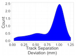

# Train Video Analytics

## Track Monitoring

Particularly in light of unusually warm weather [1](http://metro.co.uk/2011/06/27/train-delays-caused-by-rail-tracks-overheating-as-speed-limits-imposed-58022/), [2](http://www.railway-technology.com/features/featuretension-and-strain-on-overheated-trains/), [3](http://chicago.cbslocal.com/2012/07/19/cta-working-to-prevent-overheated-rails-other-heat-related-problems/), the risks of railway accidents has dramatically increased over the last years. Inspections using special trains are costly and infrequent (twice a week, [4](http://chicago.cbslocal.com/2012/07/18/union-pacific-railroad-concedes-misstatements-about-deadly-wreck/) ), while changes can happen over the course of a single day.

## Train-based Cameras

SUMMARY_STARTBy mounting inexpensive portable imaging devices on each train, we can collect real-time image information on each of the tracks beingSUMMARY_END crossed by processing the images using our Spark Image Layer.

<div class='half-width-image'>
  
  
  
</div>

## How?

The first question is how the data can be processed. The basic work is done by a simple workflow on top of our Spark Image Layer. This abstracts away the complexities of cloud computing and distributed analysis. You focus only on the core task of image processing.

<div class="half-width-image">
  
</div>

Beyond a single train, our system scales linearly to multiple trains and computers to keep the computation real-time.


With cloud-integration and Big Data-based frameworks, even handling an entire train network with 100s of trains running continuously is an easy task without worrying about networks, topology, or fault-tolerance. Below is an example for 30 trains where the tasks are seamlessly, evenly divided among 50 different machines.


## What?

The images which fly past the train at hundreds of meters per second are rich in information about the tracks, structure, and even details to potential upcoming dangers. The first basic task is the segmentation of the tracks which can provide information on their separation, surface smoothness, and direction.

<div class='quater-width-image'></div>

The segmented image above can be transformed into quantitative metrics at each time point. These metrics can then be processed to extract relevant quality assessment information for the tracks.


Each time point from the video is shown here as a point and line corresponding to the left and right tracks.


Distributions of the optically estimated track surface can then be made for each track over the course of the journey.


The distance between the two tracks can also be estimated over the entire journey.


The information from each camera can be displayed with position instead of time, and displayed visually using mapping APIs.


<iframe height="560" width="560" src="http://4quant.com/Railway-Check/widget_distmap.html"></iframe>

With many train-mounted cameras the entire network can then be analyzed in real-time, with interactive alerts showing directly on the route plan.

<iframe height="560" width="560" src="http://4quant.com/Railway-Check/widget_samap.html"></iframe>

## Technical Aspects

### Streaming the Data

Once the cluster has been comissioned and you have the StreamingSparkContext called `ssc` (automatically provided in [Databricks Cloud](https://databricks.com/product/databricks) or [Zeppelin](http://zeppelin.incubator.apache.org/), the data can be loaded using the Spark Image Layer. Since we are using real-time analysis, we acquire the images from a streaming source

```
  val trainCam1 = TrainCameraReceiver("sbb://train-3275") <br>
  val trainCam2 = TrainCameraReceiver("sbb://train-3187") <br>
  val metaImageStream = ssc.receiverStream(trainCam1 ++ trainCam2)
```

Although we execute the command on one machine, the analysis will be distributed over the entire set of cluster resources available to `ssc`. To further process the images, we can take advantage of the rich set of functionality built into Spark Image Layer

```
  def identifyTracks(time: Double, pos: GeoPos, inImage: Img[Byte]) = {
    // Run the image processing steps on all images
    val rawTrack = inImage.
      run("Median...","radius=3"). // filter out the noise
      run("Tubeness..."). // highlight tube-like structures (tracks)
      run("Threshold","OTSU") // threshold bright structures
    val trackShape = rawTrack.
      componentLabel(). // identify the components of the track
      filter(_.area>50). // take only the larger sized
      shapeAnalysis() // analyze the position and shape
    // return smoothness and separation based on the segmented image
    TrackInformation(smoothness=rawTrack.smoothness(), separation=calcSep(trackShape))
  }
  // apply the operation to all images as they come in
  val trackStream = metaImageStream.map(identifyTracks)
```

The detailed information with time, position and track data can then be compared to reference values to find changes and alert the user

```
  trackStream.foreachRDD{
    trackStream =>
      val changePoints = trackStream.
        join(trackStandards).
        filter{
          case(newData,oldResults) => abs(oldResults-newData)>0.05
        }.collect()
        // update the map
        updateMap(changePoints)
        // send an alert
        changePoints.map(
          (newPt,_) =>
            sendAlert(newPt.pos+" at "+newPt.time+" has changed by more then 5%")
        )
  }
```

The entire pipeline can then be started to run in real-time on all the new images as they stream in. If the tasks become more computationally intensive, then the computing power can be scaled up and down elastically.
