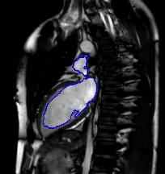
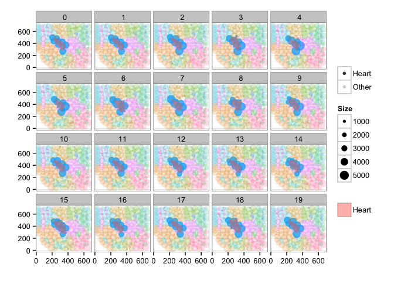

# Improving Surgery and Radiotherapy with Real-time Analysis

## Static prescan images are a poor guide for treatment

SUMMARY_STARTThe standard procedure for both radiotherapy and surgery involves making scans and planning treatment prior to the operationSUMMARY_END. In the mean time, organs can shift, the patient breaths, and occasionally the alignment during the scan and operation do not match completely. For many situations these shifts are not important, but around sensitive organs and small tumors these can mean the difference between recovery and relapse.

## Real-time Imaging and Segmentation

The latest surgical suites and MRI technologies have made subsecond measurements a reality. These measurements are already being used to assist therapy, but the value is limited without the ability to process the images in real-time.

```
SELECT Image as ChestCT FROM PatientImages WHERE Modality="CT" AND Region="Chest"
```


### Perform Segmentation

```SELECT CHEST_SEGMENTATION(Image) as ChestSeg FROM ChestCT```


### Extract the heart since it is the most dose-sensitive

```SELECT HeartRegion FROM ChestSeq```



### Track the Position of the Heart

```SELECT CenterOfMass(roi) FROM HeartRegion GROUP BY time```



It is also possible to create outlines from the structures which can then be used to update surgical plans, and provide information to the latest generation of devices which can then updating the treatment plan in real time.

```SELECT CreateOutlines(roi) FROM HeartRegion GROUP BY Organ```


### Image Query and Analysis Engine

Despite recent boosts in popularity, both personalized and precision medicine are typically far removed from the clinical setting. In many of these cases, all of the data required for significantly better informed diagnosis. Hospitals are required to archive a majority of patient imaging studies and scans for a minimum of 10 years. These essential data are just sitting unused on PACS, tapes, and other storage volumes

*IQAE* is the key to unlocking the potential of this data and turning it from a burden into an asset. The data can be analyzed in a completely anonymized manner to obtain general, precise statistics as references against which to compare new patients. Additionally careful analysis of all data can reveal mistakes, missed diagnoses, and new potential high risk patients.

### Machine Learning

The quantitatively meaningful data can then be used to train machine learning algorithms (decision trees to SVM) in order to automatically high-light many of the interesting regions and label them as such, dratistically reducing the required time to analyze a single patient.

Here we show a simple decision tree trained to identify lesions using color, position, texture and shape.


Furthermore the ability to parallelize and scale means thousands to millions of videos can be analyzed at the same time to learn even more about the structures of the digestive track and identify new possibilities for diagnosis.

### How

The first question is how the data can be processed. The basic work is done by a simple workflow on top of our Spark Image Layer. This abstracts away the complexities of cloud computing and distributed analysis. You focus only on the core task of image processing.

<div class="half-width-image">
  
</div>

The true value of such a scalable system is not in the single analysis, but in the ability to analyze hundreds, thousands, and even millions of samples at the same time.


With cloud-integration and Big Data-based frameworks, even handling an entire city network with 100s of drones and cameras running continuously is an easy task without worrying about networks, topology, or fault-tolerance.

## Technical Aspects

### Processing the Data

Once the cluster has been comissioned and you have the StreamingSparkContext called `ssc` (automatically provided in [Databricks Cloud](https://databricks.com/product/databricks) or [Zeppelin](http://zeppelin.incubator.apache.org/)), the data can be loaded using the Spark Image Layer. Since we are using real-time analysis, we acquire the images from a streaming source.

```
  val mriScanner = MedicalCameraReceiver("https://mri-scanner-8091")<br/>
  val metaImageStream = ssc.receiverStream(mriScanner)
```

Although we execute the command on one machine, the analysis will be distributed over the entire set of cluster resources available to `ssc`. To further process the images, we can take advantage of the rich set of functionality built into Spark Image Layer. The entire pipeline can then be started to run in real-time on all the new images as they stream in. If the tasks become more computationally intensive, then the computing power can be scaled up and down elastically using on-premise or cloud-based machines based on the regulatory nature of the environment.

## Learn More

4Quant is active in a number of different areas from medicine to remote sensing. Our image processing framework (Spark Image Layer) and our query engine (*Image Query and Analysis Engine*) are widely adaptable to a number of different specific applications.

Check out our other use-cases to see how *4Quant* can help you

#### Medicine

* [Planning surgery and radiotherapy with real time segmentations](http://4quant.com/Realtime-MRI-Segmentation)
* [Segmenting organs from archived chest CT images](http://4quant.com/Organ-Segmentation/)
* [Finding lesions in Capsule Based Endoscopy](http://4quant.com/Capsule-Endoscopy)

#### Geographic Information Systems

* [Calculating Flood Risk for Insurance Companies](http://4quant.com/Flood-Risk)
* [Counting Cars in Satellite Images](http://4quant.com/countingcarsdemo)
* [Finding buildings and forests in Satellite Images](http://4quant.com/geospatialdemo/)

#### Surveillance

* [Count people from drone footage](http://4quant.com/Drone-People-Counting)
* [Finding criminals with traffic cameras](http://4quant.com/Pursuing-Criminals/)

#### Real-time QA

* [Check train tracks in real time](http://4quant.com/Railway-Check)

#### Fun

* [Untangling the flood of Online Dating](http://4quant.com/Online-Dating)
* [Quantitative Image Search Machine](http://kmader.shinyapps.io/SearchMachineDemo)

### Technical Presentations

To find out more about the technical aspects of our solution, check out our presentation at:

* [Spark Summit](http://4quant.com/spark-east-2015) or watch the [video](https://www.youtube.com/watch?v=ohR_y7HZaHA&index=10&list=PL-x35fyliRwiy50Ud2ltPx8_yA4H34ppJ).
* [Synchrotron Radiation Instruementation 2015](http://4quant.com/SRI2015)
* [ICTMS 2015](http://4quant.com/ICTMS2015)
* [LifeScienceForumBasel 2015](http://4quant.com/LSFB2015)
