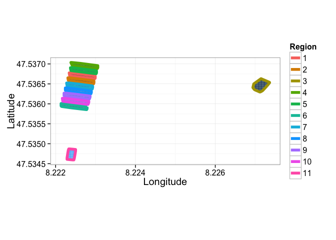
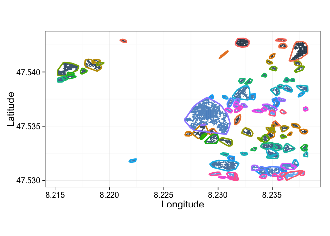

# Satellite Image Demo

## ESRI Satellite Images

SUMMARY_STARTWe start off with the satellite images overSUMMARY_END the [Paul Scherrer Institute](http://www.psi.ch/) in Villigen, Switzerland (acquired from [ESRI ArcGIS Online](http://server.arcgisonline.com/))

<iframe height="560" width="560" src="http://4quant.com/geospatialdemo/map_unnamed-chunk-2.html"></iframe>

### Load the data in

Once the Spark Cluster has been created and you have the *SparkContext* called `sc` (automatically provided in [Databricks Cloud](https://databricks.com/product/databricks-cloud) or [Zeppelin](http://zeppelin.incubator.apache.org/)), the data can be loaded using the Spark Image Layer. The command `readTiledImage` loads in the data as tiles and can read mega-, giga-, even petabytes of data from Amazon’s [S3](http://aws.amazon.com/s3/), Hadoop Filesystem ([HDFS](http://hortonworks.com/hadoop/hdfs/)), or any shared / network filesystem.

val psiBingImage = sc.readTiledImage\[Double]("s3n://geo-images/esri-satimg/psi*.png",256,256).cache

Although we execute the command one one machine, the data will be evenly loaded over all of the machines in the cluster (or cloud). The `cache` suffix keeps the files in memory so they can be read faster as many of our image processing tasks access the images a number of times.

### Finding Reflective Objects

  As our first task we want to identify all of the reflective objects, for this we - apply a threshold to the average intensity `((red+blue+green)/3)` - identify the distinct regions - analyze the area and perimeter of the regions

### Threshold / Segmentation

  // Segment out all of the non-zero points  
  val pointImage = psiBingImage.sparseThresh(_.intensity>200).cache

### Shape Analysis (Area and Perimeter)

  // Run a shape analysis to measure the position, area, and intensity of each identified region  
  val shapeAnalysis = EllipsoidAnalysis.runIntensityShapeAnalysis(uniqueRegions)

<iframe height="560" width="560" src="http://4quant.com/geospatialdemo/map_unnamed-chunk-8.html"></iframe>

### Estimating Tree Coverage

To estimate the tree coverage is a slightly more difficult problem, but involves fundamentally the same types of analysis. For this we will use a different threshold criteria for identifying the trees and then apply some morphological operations to group nearby objects together.

#### Threshold / Segmentation

We identify the tree regions using a fairly simple rule with two criteria

  <ol>
    <li>`Green > (Red+Blue)/2`</li>
    <li>`Green > 50`</li>
  </ol>

We also see that the code which we write, although it is parallel and running over a whole cluster of computers, mirrors the math nicely and contains none of the details of cluster or data management.

  // Segment out all of points which meet the following criteria  
  val treeImage = psiBingImage.sparseThresh{  
    pixVal =>  
      // the green is brighter than the average of the red and the blue  
      (pixVal.green>(pixVal.red+pixVal.blue)/2) &  
      // the green value itself is dark (trees do not reflect much)  
      (pixVal.green<50)   
    }.cache

#### Connecting nearby groups

We use the information in the neighborhood of each pixel to connect groups of nearby pixels together (two small adjacent clumps become one). This operation is known in image processing as a [Morphological Close](https://rawgithub.com/kmader/Quantitative-Big-Imaging-2015/master/Lectures/03-Slides.html#/37)

  // Perform 3 closing operations to connect the nearby tree regions together  
  val treeGroupImage = Morphology.close(treeImage,3)

#### Identifying Regions

We apply component labeling and then filter to results to only keep the middle sized objects (too small are just artifacts or noise, too large is the river and other dark, green objects)

  // Label each region using connected component labeling with a 3 x 3 window  
  val treeRegions = ConnectedComponents.  
    Labeling2DChunk(treeGroupImage).filter{  
    tRegion =>  
      // we now remove the small single dark regions  
      tRegion.area>1000 &   
      // since some of the river is classified as 'tree' as well we can remove all very large objects  
      tRegion.area<500000  
    }

<iframe height="560" width="560" src="http://4quant.com/geospatialdemo/map_unnamed-chunk-12.html"></iframe>

#### Shape Analysis (Area, Perimeter, Concavity)

Now we can calculate the shape information for the tree areas to look at some of the statistics

  // Run a shape analysis to measure the position, area, and intensity of each identified region  
  val shapeAnalysis = EllipsoidAnalysis.runIntensityShapeAnalysis(treeRegions)

We can then place the statistics back onto the map (for the largest ones)

<iframe height="560" width="560" src="http://4quant.com/geospatialdemo/map_unnamed-chunk-14.html"></iframe>

### Density Plots

Additionally metrics can be calculated like tree density and displayed on their own

Or projected back on top of the original data and a standard map

<iframe height="560" width="560" src="http://4quant.com/geospatialdemo/map_unnamed-chunk-14.html"></iframe>

<!-- CDN for MATH formulas -->

